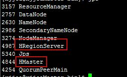

hadoop大数据
=========
## 说明
     学习笔记
## 目录
* [hadoop大数据](#hadoop大数据)
	* [一、主要组件](#一主要组件)
		* [1、HDFS](#1HDFS)
		* [2、MapReduce](#2MapReduce)
		* [3、HBase](#3HBase)
		* [4、ZooKeeper](#4ZooKeeper)
		* [5、Hive](#5Hive)
		* [6、Sqoop](#6Sqoop)
		* [7、Flume](#7Flume)
		* [8、Mahout](#8Mahout)
		* [9、YARN](#9YARN)
		* [10、Mesos](#10Mesos)
		* [11、Spark](#11Spark)
		* [12、kafka](#12kafka)
		* [13、Phoenix](#13Phoenix)
		* [14、Ambari](#14Ambari)
	* [二、Hadoop大数据平台搭建](#二Hadoop大数据平台搭建)
		* [1、集群搭建先决条件](#1集群搭建先决条件)		
		* [2、Hadoop集群安装](#2Hadoop集群安装)	
		* [3、ZooKeeper集群安装](#3ZooKeeper集群安装)
		* [4、HBase集群安装](#4HBase集群安装)	
		* [5、Kafka集群安装](#5Kafka集群安装)	
	
### 一、主要组件
以Hadoop为核心，Hadoop大数据应用生态中最主要的组件，在整个大数据应用于研发已经形成了一个基本完善的生态系统。
### 1、HDFS
- Hadoop分布式文件系统，通过流式数据访问，提供高吞吐量应用程序数据访问功能，适合大型数据集的应用程序。
### 2、MapReduce
- 分布式离线计算框架，用Map和Reduce两个函数编程实现基本的并行计算任务。实时流计算一般用Storm
### 3、HBase
- 是一个高可靠性、高性能、面向列、可伸缩的分布式存储系统，利用HBase技术可在廉价PC上搭建起大规模结构化存储集群。
### 4、ZooKeeper
- 是一个分布式的，开放源码的分布式应用程序协调服务，是Hadoop和Hbase的重要组件。
### 5、Hive
- 是建立在 Hadoop 上的数据仓库基础构架，可以将结构化的数据文件映射为一张数据库表，并提供简单的sql查询功能，可以将sql语句转换为MapReduce任务进行运行。
### 6、Sqoop
- 是一个用来将Hadoop和关系型数据库中的数据相互转移的工具，可以将一个关系型数据库<br>
（如 ： MySQL ,Oracle ,Postgres等）中的数据导进到Hadoop的HDFS中，也可以将HDFS的数据导进到关系型数据库中。
### 7、Flume
- 是Cloudera提供的日志收集系统，目前是Apache下的一个孵化项目，Flume支持在日志系统中定制各类数据发送方，用于收集数据。
### 8、Mahout
- 一个开源项目，提供一些可扩展的机器学习领域经典算法的实现，Mahout包含许多实现，包括聚类、分类、推荐过滤、频繁子项挖掘。
### 9、YARN
- 是一个通用资源管理系统，可为上层应用提供统一的资源管理和调度，是MapReduce的改进。
### 10、Mesos
- 是一个通用的集群管理器，是Apache下的开源分布式资源管理框架。
### 11、Spark
- 是一种与 Hadoop 相似的开源集群计算环境，Spark 启用了内存分布数据集，在某些工作负载方面表现得更加优越。
### 12、kafka
- 是一种高吞吐量的分布式发布订阅消息系统，它可以处理消费者在网站中的所有动作流数据。（如：网页浏览，搜索和其他用户的行动）。
### 13、Phoenix
- 是构建在HBase上的一个SQL层，能让我们用标准的JDBC APIs而不是HBase客户端APIs来创建表，插入数据和对HBase数据进行查询。
### 14、Ambari
- i是一种基于Web的工具，支持Apache Hadoop集群的供应、管理和监控。Ambari已支持大多数Hadoop组件，包括HDFS、MapReduce、Hive、Pig、 Hbase、Zookeeper、Sqoop等。
### 二、Hadoop大数据平台搭建
### 1、集群搭建先决条件
- 配置hadoop用户及其用户组(集群机)
- 永久修改主机名(集群机)：vim /etc/sysconfig/network，修改了reboot重启，hostnamea查看是否生效
- 配置防火墙(集群机)
- 安装jdk(集群机)
- 配置免密钥登录(集群机)
- 配置集群时间同步
### 2、Hadoop集群安装
- 解压 tar -zxvf hadoop-2.8.5.tar.gz
- 配置hadoop启动的jdk 
```
hadoop-2.8.5/etc/hadoop/hadoop-env.sh
找到并修改为 export JAVA_HOME=/data/jdk1.8.0_191/
```
- 配置hadoop环境变量
```
export HADOOP_HOME=/data/hadoop-2.8.5
export PATH=$HADOOP_HOME/bin:$PATH
执行命令source  /etc/profile 使得hadoop环境变量生效
```
- 创建Hadoop数据目录：mkdir hadoopdata
- 配置核心core-site.xml
```
<configuration>
    <property>
		<name>fs.defaultFS</name>
		<value>hdfs://Master:8020</value>
	</property>
	<property>
		<name>hadoop.tmp.dir</name>
		<value>/data/hadoopdata</value>
	</property>
</configuration>
```
- 配置文件系统hdfs-site.xml
```
<configuration>
	<property>
		<name>dfs.replication</name>
		<value>3</value>
	</property>
	<property>
		<name>dfs.namenode.name.dir</name>
		<value>/data/hadoopdata/dfs/name</value>
	</property>
	<property>
		<name>dfs.datanode.data.dir</name>
		<value>/data/hadoopdata/dfs/data</value>
	</property>
	<property>
        <name>dfs.namenode.http-address</name>
        <value>Master:50070</value>
    </property>
	<property>
		<name>dfs.permissions</name>
		<value>false</value>
	</property>
</configuration>
```
- 配置yarn-site.xml文件
```
<configuration>
	<property>
		<name>yarn.resourcemanager.hostname</name>
		<value>Master</value>
	</property>
	<property>
		<name>yarn.nodemanager.aux-services</name>
		<value>mapreduce_shuffle</value>
	</property>
</configuration>
```
- 配置mapred-site.xml计算框架文件：cp mapred-site.xml.template mapred-site.xml（复制）
```
<configuration>
	<!--指定运行mapreduce的环境是yarn-->
	<property>
		<name>mapreduce.framework.name</name>
		<value>yarn</value>
	</property>
</configuration>
```
- 配置master上的slave文件
```
Master
Slave0
Slave1
```
- 将主节点master上的hdaoop文件拷贝到各个节点
```
scp -r hadoop-2.8.5 @ip:~/ 
```
- 启动hadoop集群：切换到hadoop用户操作(su - hadoop)
```
首次启动需要先在 Master节点执行格式化：$ bin/hadoop namenode -format
启动：在主节点上执行 $ bin/start-all.sh 或 先start-dfs.sh,再start-yarn.sh
```
- 验证集群搭建成功
在mater上面键入jps后看到<br>
<br>
在slave上键入jps后看到<br>
<br>
则说明集群搭建成功（或者访问web验证：http://ip:50070）
- 停止Hadoop：在主节点上执行 $ bin/stop-all.sh
### 3、ZooKeeper集群安装
- 切换到hadoop用户(su - hadoop)，解压 tar -zxvf zookeeper-3.4.14.tar.gz 
- 创建ZooKeeper数据目录 mkdir zookeeper
- 创建myid文件 
```
touch myid
echo "1" > myid
```
- 配置zoo.cfg（复制 cp zoo_sample.cfg zoo.cfg）
```
dataDir=/data/zookeeper/data
dataLogDir=/data/zookeeper/dataLog
server.1=Master:2888:3888
server.2=Slave0:2888:3888
server.3=Slave1:2888:3888
```
- 拷贝zookeeper文件到各个节点
```
scp -r zookeeper-3.4.14 @ip:~/ 
```
- 修改各节点的myid文件
- 在各节点配置环境变量/etc/profile
```
export ZOOKEEPER_HOME=/home/fesh/zookeeper-3.4.6
export PATH=$PATH:$ZOOKEEPER_HOME/bin
执行source /etc/profile生效
```
- 启动zookeeper：在$ZOOKEEPER_HOME目录下，运行bin/zkServer.sh start 启动(集群机)
- 查看启动状态：bin/zkServer.sh status，可以看到三台机器会有两个follower和一个leader<br>
或者用jps命令查看会有进程：QuorumPeerMain
### 4、HBase集群安装
- 切换到hadoop用户(su - hadoop)，解压 tar -zxvf hbase-2.0.5.tar.gz (HBase必须选择与hadoop相对应的版本)
- 创建hbase数据目录 mkdir hbasedata
- 拷贝hadoop 的 hdfs-site.xml 和 core-site.xml 放到 hbase-2.0.5/conf 下
- 修改hbase-env.sh
```
export JAVA_HOME=/data/jdk1.8.0_191
export HBASE_LOG_DIR=/data/hbasedata/logs
export HBASE_PID_DIR=/data/hbasedata/pids
export HBASE_MANAGES_ZK=false #使用外部的zk
```
- 修改 hbase-site.xml
```
<configuration>
    <!-- 指定hbase在HDFS上存储的路径 -->
    <property>
        <name>hbase.rootdir</name>
        <value>hdfs://Master:8020/hbase</value>
    </property>
	<property>
		<name>hbase.master.maxclockskew</name>
		<value>180000</value>
	</property>
	<property>
		<name>hbase.zookeeper.property.dataDir</name>
		<value>/data/zookeeper/data</value>
	</property>
	<property>
		<name>hbase.cluster.distributed</name>
		<value>true</value>
	</property>
	<property>
		<name>hbase.unsafe.stream.capability.enforce</name>
		<value>false</value>
	</property>
	<property>
		<name>zookeeper.session.timeout</name>
		<value>300000</value>
	</property>
	<property>
		<name>hbase.zookeeper.quorum</name>
		<value>Master:2181,Slave0:2181,Slave1:2181</value>
	</property>
</configuration>
```
- 配置HBase master的备用节点：新建backup-masters文件，修改内容为Slave0
- 修改regionservers 文件：vim regionservers
```
Slave0
Slave1
```
- 将HBase安装包分发到其他节点
```
scp -r hbase-2.0.5 @ip:~/
```
- 在各节点配置HBase环境变量：vim /etc/profile
```
export HBASE_HOME=/export/servers/hbase-2.0.5/
export PATH=$HBASE_HOME/bin:$PATH
执行source /etc/profile生效
```
- 启动HBase并验证：在主节点上运行 start-hbase.sh 通过浏览器访问hbase管理页面验证(http://ip:16010)<br>
或在mater上面键入jps后看到<br>
<br>
在slave上键入jps后看到<br>
<br>
- 开启HBase的thrift进程：$HBASE_HOME/bin/hbase-daemon.sh start thrift

### 5、Kafka集群安装
- 切换到hadoop用户(su - hadoop)，- 解压 tar -zxvf kafka_2.12-2.2.1.tgz
- 配置Kafka环境变量
```
export Kafka_HOME=/data/kafka_2.12-2.2.1
export PATH=$PATH:$Kafka_HOME/bin
执行命令source  /etc/profile 使得环境变量生效
```
- 创建存放kafka消息目录：mkdir kafka-logs
- 打开vim server.properties 修改文件主要参数
```
broker.id=0 #当前机器在集群中的唯一标识，和zookeeper的myid性质一样
log.dirs=/data/kafka-logs #kafka数据的存放地址，多个地址的话用逗号分割 /data/kafka-logs-1，/data/kafka-logs-2
advertised.listeners=PLAINTEXT://192.168.0.47:9092
zookeeper.connect=ip:2181,ip:2181,ip:2181 #Zookeeper连接参数
```
- 拷贝kafka文件到各个节点，在各个节点修改vim server.properties文件的broker.id，并mkdir kafka-logs
```
scp -r kafka @ip:~/ 
```
- 启动Kafka并验证：在集群机上进入cd 主目录，运行 bin/kafka-server-start.sh -daemon config/server.properties<br>
在控制台上输入jps后看到<br>
